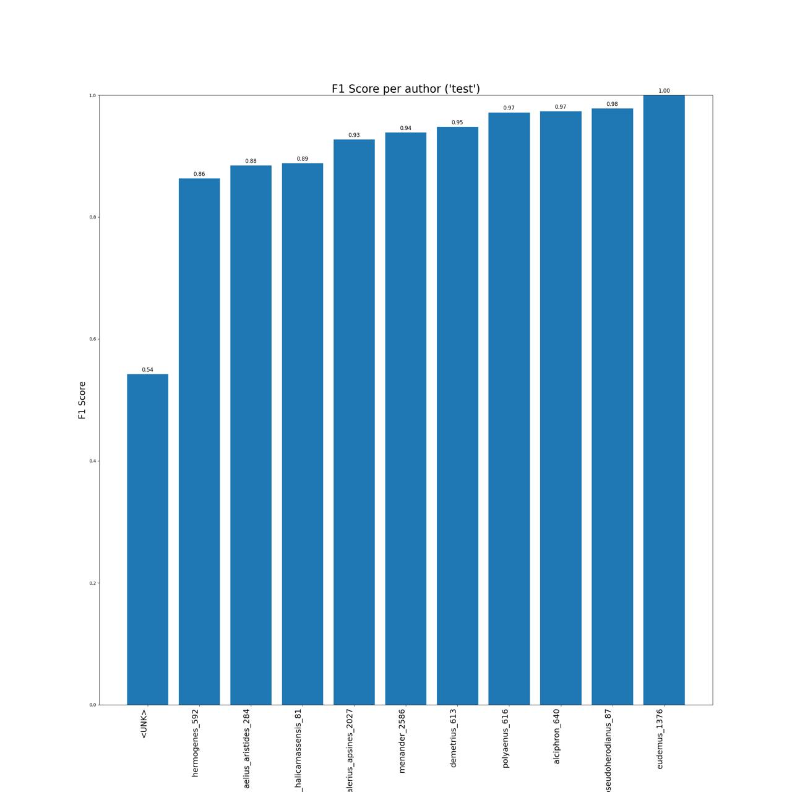

# Fine-Tuning Pre-Trained Language Models for Authorship Attribution of the Pseudo-Dionysian Ars Rhetorica
The repository contains the code and the data for the paper "Fine-Tuning Pre-Trained Language Models for Authorship Attribution of the Pseudo-Dionysian _Ars Rhetorica_" by Gleb Schmidt, Veronika Vybornaya, and Ivan P. Yamshchikov, presented as a poster at the Computational Humanities Research Conference (December 4–6, 2024, Aarhus, Denmark):
```bibtex
@inproceedings{plm_aa_ars_rhetorica,
  title={Fine-Tuning Pre-Trained Language Models for Authorship Attribution of the Pseudo-Dionysian <i>Ars Rhetorica</i>},
  author={Schmidt, Gleb and Vybornaya, Veronika and Yamshchikov, Ivan P.},
  booktitle={Proceedings of the Computational Humanities Research Conference},
  eventtitle={Computational Humanities Research Conference},
  eventdate = {2024-12-04/2024-12-06},
  year={2024}
}
```
## Structure of the repository
* ``data/preprocessed`` Chunked (i.e., tokenized - chunked - back-decoded) data used for MLM fine-tuning and classifiers training. 
    * ``data/preprocessed/mlm_preprocessed_dataset.csv)`` Chunks of 512 tokens used for MLM.
    * ``data/preprocessed/classification_preprocessed_dataset.csv)`` Chunks of 64 tokens overlapping by 32 tokens used for classification training.
* ``src``
    * ``datasets`` LightningDataModule and dataset classes for managing the data used in the study.
    * ``classification`` Contains LightningModule used for the experiments with classifiers and their training.
    * ``MlmTuningModule.py`` LightningModule for MLM fine-tuning (mostly wrapping the Huggingface's AutoModelForMaskedLM).

## Performance of the classifiers
### Overall performance on the test set
| Model                                                                        | Test Accuracy | Test F1 |
|------------------------------------------------------------------------------|---------------|---------|
| [bowphs/GreBerta (R)](https://huggingface.co/glsch/bowphs_GreBerta_rhetores) | 90.14         | 90.12   |
| [pranaydeeps/Ancient-Greek-BERT](https://huggingface.co/pranaydeeps/Ancient-Greek-BERT)                                           | 83.68         | 81.83   |
### Per-class F1-score on the test set

`<UNK>` label was present only in the validation data. The model was trained to assign it when the top prediction probability was below 0.8.


[//]: # (### Tuning setup)

[//]: # (All the models were tuned as long as Cross-Entropy loss continued to decrease more than 0.05 over 3 epochs &#40;for more parameters, see the article&#41;.)

[//]: # (Mask probability 0.15. )

[//]: # ()
[//]: # (|      Base transformer          | Stopped after epoch | Best CE on val set | Test CE | LR   |)

[//]: # (|--------------------------------|---------------------|--------------------|---------|------|)

[//]: # (| bowphs/GreBerta                | 15                  | 1.82               | 1.83    | 5e-5 |)

[//]: # (| altsoph/bert-base-ancientgreek-uncased              | 20                  | 1.77               | 1.73    | 1e-4 |)

[//]: # (| pranaydeeps/Ancient-Greek-BERT              | 13                  | 1.63                   | 1.59    |   1e-4   |)

[//]: # ()
[//]: # (## Classifier training)

[//]: # (### Dataset)

[//]: # (Each transformer and its derivative tuned on our corpus of orators and rhetorician were used to train a sequence classification model. Therefore, we trained 6 models in total.)

[//]: # ()
[//]: # (|              |                                                          |)

[//]: # (|--------------|----------------------------------------------------------|)

[//]: # (| Authors      | 19, 10 classes and 9 added to the test corpus as "<UNK>" |)

[//]: # (| Tokenizer    | bowphs/GreBerta                                          |)

[//]: # (| Total chunks | 15,245                                                   |)

[//]: # (| Chunk length | 128                                                      |)

[//]: # (| Overlap      | 0.5 %                                                    |)

[//]: # ()
[//]: # ()
[//]: # ()
[//]: # (### )


